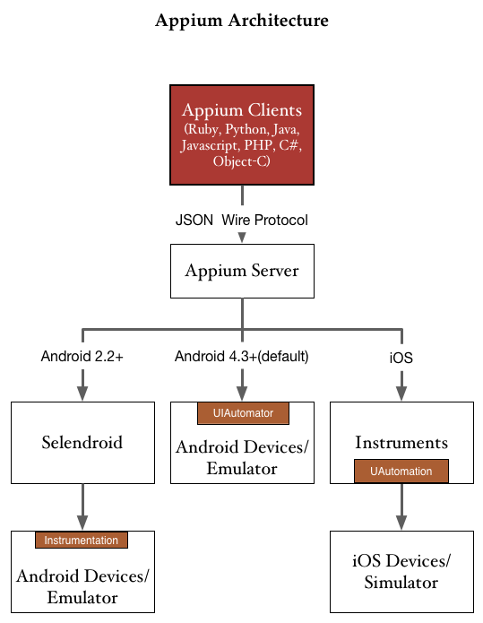

# Appium 架构简述

Appium 主要采用 C/S 架构，基本架构图如下：

* 在 Android 4.3 及以上，使用 UIAutomator 控制设备
* 在 Android 2.2 及以上，使用 Selendroid 控制设备（此时需要手动设置 server 参数 `--automation-name Selendroid` 或在测试脚本中设定 capability `"automationName":"Selendroid"` ）
* 在 iOS 上使用 Instruments 中的 UIAutomation 控制设备