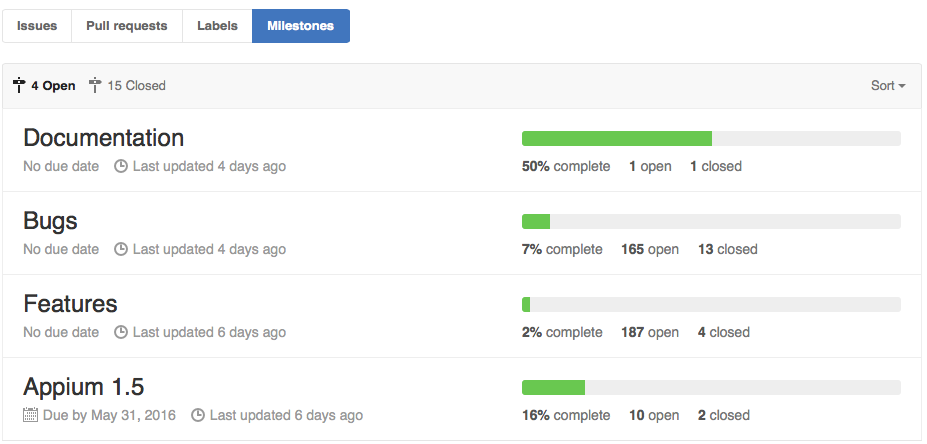

# Appium MileStone

> 参考 <https://github.com/appium/appium/milestones>

MileStone 意为里程碑。一般一个改动比较大的版本称为一个 MileStone 。

对于 appium ，中间版本号的变更一般会作为一个 MileStone，如 Appium 1.4，Appium 1.5 为一个里程碑。小版本号的变更一般为 bug fix 或者小功能的添加，如 Appium 1.4.7 到 1.4.8 之间的变更为[ fix 了两个 bug ](https://discuss.appium.io/t/appium-version-1-4-8-released/5209)。

本文编写时 Appium 未来的 MileStone  如下：

各 milestone 说明：

* Documentation：文档编写。本文编写时仅有一个对应的 issue ：[Document usage of chromeOptions](https://github.com/appium/appium/issues/4487)
* Bugs：存在的缺陷。所有缺陷均在[此列表](https://github.com/appium/appium/milestones/Bugs)中。
* Features：需要添加的新特性。所有关于 appium 未来新功能的 issue 均在[此列表](https://github.com/appium/appium/milestones/Features)中
* Appium 1.5：在 Appium 1.5 中需要完成的 issue ，即 appium 1.5 中将会出现的新特性。